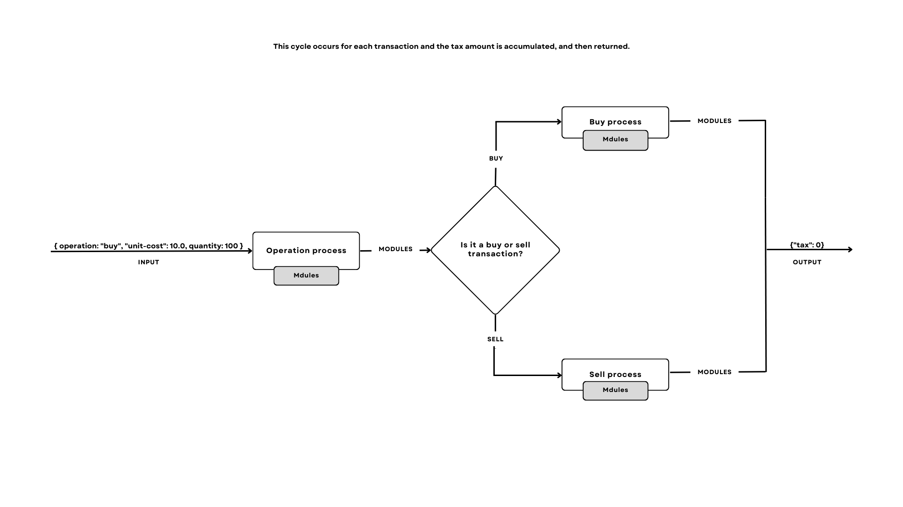

<div align="center">
  <h3 align="center">Capital Gains</h3>

  <p align="center">
    Calculates the tax to be paid on profits or losses from operations in the financial stock market
</div>


<!-- TABLE OF CONTENTS -->
<details>
  <summary>Table of Contents</summary>
  <ol>
    <li>
      <a href="#about-the-project">About The Project</a>
       <ul>
        <li><a href="#project-architecture">Project Architecture</a></li>
      </ul>
      <ul>
        <li><a href="#built-with">Built With</a></li>
      </ul>
    </li>
    <li>
      <a href="#getting-started">Getting Started</a>
      <ul>
        <li><a href="#prerequisites">Prerequisites</a></li>
        <li><a href="#docker">Docker</a></li>
        <li><a href="#local">Local</a></li>
        <li><a href="#scripts">Scripts</a></li>
      </ul>
    </li>
    <li><a href="#usage">Usage</a></li>
  </ol>
</details>


<!-- ABOUT THE PROJECT -->
## About The Project

Capital Gain is a command-line program (CLI) that calculates the tax to be paid on profits or losses from operations in the financial stock market through lists, one per line, of operations in the financial stock market in format json through standard input ( stdin ).

For each line of input, it will return a list containing the tax paid for each operation received in json format via standard output ( stdout ).

## Project Architecture



<br /> <br />

The project's architecture was designed to be modular and extensible. The idea is to have separate processes that execute the rules by modules, such modules can be added or removed from the process by changing their behavior, also the modules have access to the results of the operations of other modules through a store passed as a parameter by the process.

#### Example:
The main process receives two processes as a parameter (it can receive more if that's the case) one that will validate the buy rules and another that will validate the sell rules, these two processes in turn, receive modules as a parameter that contain the rules that will calculate the rate, this way the rules are executed and return the calculated tax.


With this architecture it is possible to extend the application in more processes and each process in more modules, well defined modules and keep only one business rule.

### Folders structure
```sh
├───.devcontainer #Dev container settings
├───.vscode #VS Code settings
├───images #README.md images
└───src
    ├───config #Constants and global configurations
    ├───modules #Rules modules
    │   ├───buy
    │   └───sell
    ├───processes #Process that execute the modules
    ├───stdio #Standard I/O configurations
    ├───store #Data that is stored and modified during processes
    ├───test #Application tests
    │   ├───modules
    │   │   ├───buy
    │   │   └───sell
    │   └───store
    ├───types #Common types
    └───utils #Reusable functions
```

### Built With

<a href="https://nodejs.org/"></a>
<strong style="margin-left:8px">v18.17.1</strong>

<!-- GETTING STARTED -->
## Getting Started

Instructions on how to run the application locally and in a Docker container


### Prerequisites
#### Docker environment

* [Docker Engine](https://docs.docker.com/engine/install/)
* [VS Code](https://code.visualstudio.com/) (recommendation)


#### Local environment

* [NodeJS LTS](https://nodejs.org/)
* [VS Code](https://code.visualstudio.com/) (recommendation)


### Docker

Open the project in VS Code, install the [Dev Containers extension](https://marketplace.visualstudio.com/items?itemName=ms-vscode-remote.remote-containers), if you do not have (a recommendation about this will appear on VS Code) open the project in the dev container (the [Dev Containers extension](https://marketplace.visualstudio.com/items?itemName=ms-vscode-remote.remote-containers) will also show a suggestion for this). The install dependencies script will be triggered by dev container, done. 

### Local

Open the project in VS Code, install the project dependencies running: ```npm install``` done.

### Scripts

All these scripts are available for execution in local environment and in docker container, are also available as Task to be executed directly from the VS Code interface.

* Install dependencies
  ```sh
  npm install
  ```

* Start the builded application
  ```sh
  npm start
  ```
  
* Run application in a development server
  ```sh
  npm run dev
  ```

* Input redirection
  ```sh
  npm start < input.txt
  ```
  or
  ```sh
  npm run dev < input.txt
  ```

* Run all test
  ```sh
  npm run test
  ```

* Build the application (dist folder)
  ```sh
  npm run build
  ```

#### Docker Scripts (Containerized build)

* Build the application docker image
  ```sh
  npm build:docker
  ```
  or
  ```sh
  docker build -t capital-gains .
  ```

* Run the containerized build
  ```sh
  npm start:docker
  ```
  or
  ```sh
  docker run --rm -it capital-gains
  ```

<!-- USAGE EXAMPLES -->
## Usage

The application expects to receive lists, one per line, of financial stock market operations in format
json through standard input ( stdin ). The application does not handle input formatting errors as instructed.

The application terminates when receiving an empty line.

input: ``[{"operation":"buy", "unit-cost":10.00, "quantity": 100}, {"operation":"sell", "unit-cost":15.00, "quantity": 50}, {"operation":"sell", "unit-cost":15.00, "quantity": 50}]``

output: ``[{"tax": 0},{"tax": 0},{"tax": 0}]``
